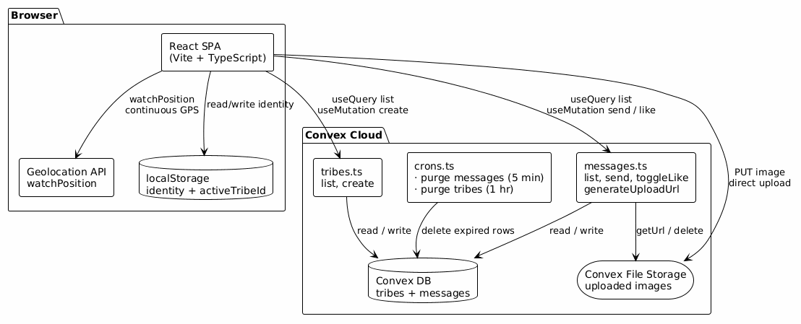
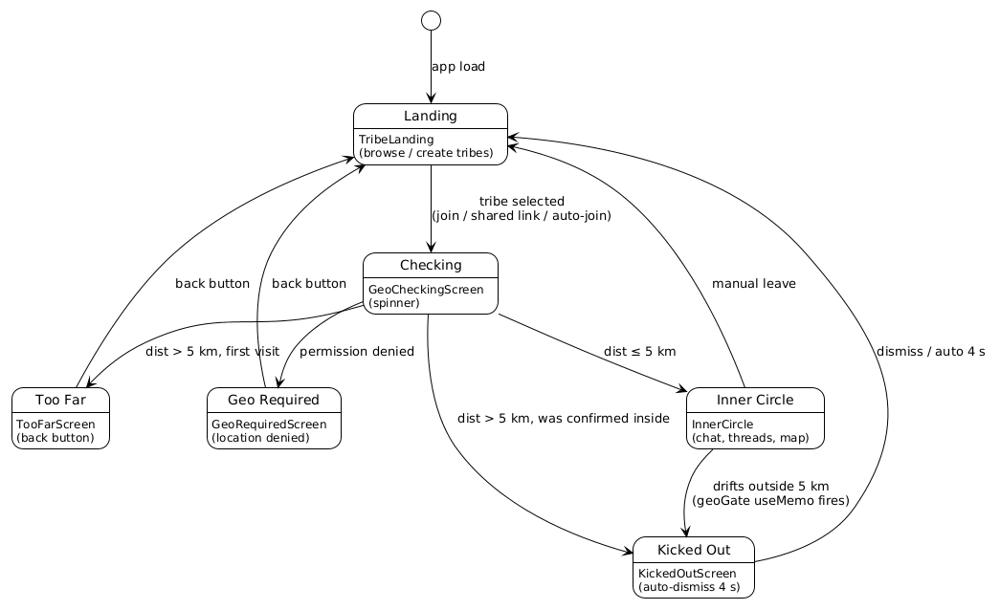
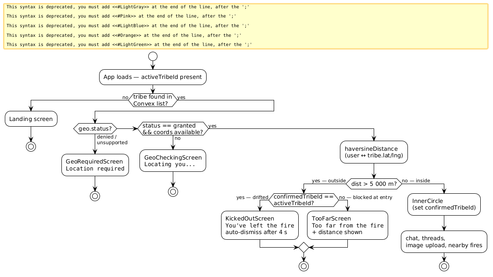
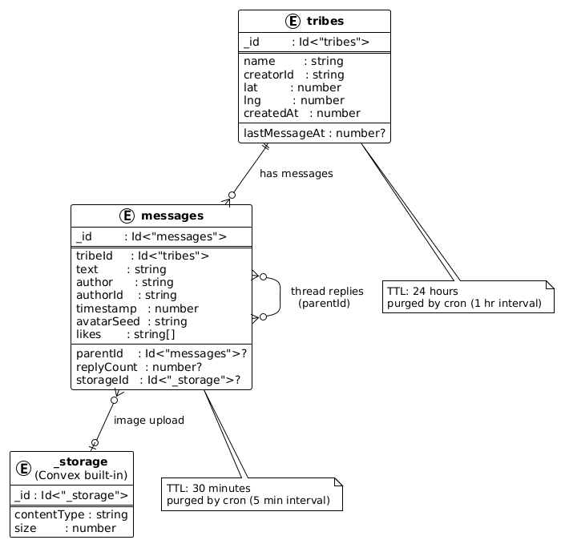
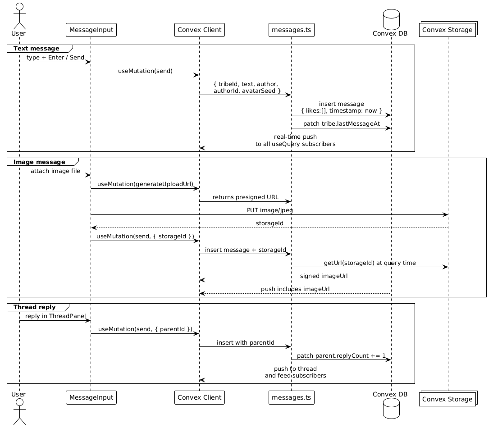

# Architecture: tribe 🔥

End-to-end breakdown of data flow, component hierarchy, geofencing logic, the message lifecycle, and the Convex backend design.

PlantUML sources for all diagrams live in [`docs/diagrams/`](./docs/diagrams/). Regenerate PNGs with `node docs/diagrams/generate.js`.

---

## System Overview



The app is a React SPA that communicates exclusively with Convex — no custom backend server. Three subsystems interact in the browser:

- **Geolocation API** — `navigator.geolocation.watchPosition` pushes GPS updates continuously; the `useGeolocation` hook converts them into a typed `GeoState`.
- **localStorage** — `useActiveTribe` persists the active tribe ID and confirmed-entry flag; `useTribeIdentity` persists the generated display name and avatar seed.
- **Convex SDK** — `useQuery` opens a live WebSocket subscription for the tribes list and message feed; `useMutation` runs server-side mutations for send, like, and create.

Image uploads bypass Convex function calls: the client fetches a presigned upload URL via `generateUploadUrl`, then PUTs the file directly to Convex File Storage and stores only the returned `storageId` in the message document.

---

## Screen State Machine



`AppShell` renders one of three top-level screens based on two reactive signals:

| Signal | Source |
|---|---|
| `activeTribeId` | `useActiveTribe` hook (localStorage + URL hash) |
| `geoGate` | `useMemo` over `geo.status` + `geo.coords` + active tribe coords |

```
screen = !activeTribe           → "landing"
screen = geoGate.status == "ok" → "inner"
screen = otherwise              → "gate"
```

`geoGate` is a **pure derivation** (no `useEffect`, no separate state). Convex's `watchPosition` fires on every GPS update, which re-renders the component and re-evaluates the memo — this is how auto-kick works with no polling loop.

The `confirmedTribeId` flag (stored in `useActiveTribe`) distinguishes a **drift-kick** (user was confirmed inside, then moved away → `KickedOutScreen`) from an **entry block** (user clicked a shared link from far away → `TooFarScreen`).

---

## Geofence Gate Logic



Distance is computed with the **Haversine formula** — great-circle distance on a sphere:

```
a = sin²(Δlat/2) + cos(lat₁)·cos(lat₂)·sin²(Δlon/2)
d = 2R · atan2(√a, √(1−a))     where R = 6 371 000 m
```

`GEOFENCE_RADIUS_M = 5000` (5 km). The same radius is drawn as a dashed ring on the campfire map.

The `useGeolocation` hook:
1. Calls `getCurrentPosition` immediately for a fast initial fix
2. Registers `watchPosition` with `enableHighAccuracy: true`, `maximumAge: 30 000 ms`
3. Every position update propagates through `geoGate` useMemo → potential screen transition

---

## Data Model



### Schema

```typescript
// convex/schema.ts
tribes: {
  name:          string
  creatorId:     string
  lat:           number
  lng:           number
  createdAt:     number
  lastMessageAt: number?          // used for "recently active" badge
}
// Index: by_createdAt

messages: {
  tribeId:    Id<"tribes">
  text:       string
  author:     string              // display name at send time
  authorId:   string              // stable userId from localStorage
  timestamp:  number
  avatarSeed: string
  likes:      string[]            // array of userIds
  parentId:   Id<"messages">?    // set for thread replies
  replyCount: number?             // denormalised counter on parent
  storageId:  Id<"_storage">?    // present when message has an image
}
// Indexes: by_tribeId_and_timestamp, by_timestamp, by_parentId_and_timestamp
```

### TTL

| Table | TTL | Cron interval |
|---|---|---|
| `messages` | 30 minutes | every 5 minutes |
| `tribes` | 24 hours | every 1 hour |

Expired rows are batch-deleted by `deleteOldMessages` and `deleteOldTribes` (internal mutations). Associated storage objects are deleted alongside their message.

### Convex Functions

| Function | Type | Description |
|---|---|---|
| `tribes.list` | query | All tribes created within the last 24 h |
| `tribes.create` | mutation | Insert tribe at creator's coordinates |
| `messages.list` | query | Messages for a tribe from the last 30 min; resolves `imageUrl` |
| `messages.listThread` | query | Replies for a parent message |
| `messages.send` | mutation | Insert message; increment parent `replyCount`; update tribe `lastMessageAt` |
| `messages.toggleLike` | mutation | Add or remove userId from `likes` array |
| `messages.generateUploadUrl` | mutation | Returns a presigned PUT URL for Convex Storage |
| `messages.deleteOldMessages` | internalMutation | Batch-delete + storage cleanup |
| `tribes.deleteOldTribes` | internalMutation | Batch-delete expired tribes |

---

## Message Lifecycle



### Text message

1. User types in `MessageInput` and presses Enter or the send button.
2. `useMutation(api.messages.send)` is called with `{ tribeId, text, author, authorId, avatarSeed }`.
3. The Convex mutation inserts the document and patches `tribe.lastMessageAt`.
4. Convex pushes the updated query result to **all active subscribers** in real time — no polling, no WebSocket boilerplate.

### Image message

1. User taps the 📷 button; a preview thumbnail appears.
2. `generateUploadUrl()` fetches a short-lived presigned URL from Convex Storage.
3. The client PUTs the file directly to Convex Storage (bypassing Convex functions entirely).
4. The returned `storageId` is passed as an extra argument to `send`.
5. The `list` query resolves `storageId → imageUrl` via `ctx.storage.getUrl()` so subscribers receive a signed URL.

### Thread reply

A reply is a normal message with `parentId` set. The mutation also increments `parent.replyCount` (denormalised) so the feed can show reply counts without a secondary query.

---

## Message Heat System

`MessageBubble` derives a "heat" property from message age at render time:

| Age | Heat | Visual |
|---|---|---|
| < 2.5 min | `hot` | Orange glow border + pulsing 🔥 |
| 2.5 – 5 min | `warm` | Dimmer border, reduced opacity |
| > 5 min | `cold` | Charcoal grey, 50 % opacity |
| > 30 min | gone | Deleted by Convex cron |

Heat re-computes on every render pass — Convex subscription updates provide the clock ticks.

---

## Identity System

No login. On first visit `useTribeIdentity` generates:

1. `userId` — `${Date.now().toString(36)}-${random}` — persisted in localStorage
2. `tribeName` — sampled from 30 adjectives × 28 nouns (840 combinations) — persisted; user can rename via the identity chip
3. `avatarSeed` — `${userId}-${tribeName}` — derived deterministically; changes when name changes

**Avatar generation** (`src/utils/avatar.ts`): The seed is hashed with DJB2 to a deterministic integer. Hue values and polygon radii are extracted from different bit ranges, producing a unique SVG polygon for every user. Output is a `data:image/svg+xml` base64 URL — no network request.

**Username picker**: New joiners (who enter via auto-join or a shared link) see a modal on first entry to choose a display name. Tribe creators set their name at creation time. The identity chip in the header opens the same modal for renaming at any time.

---

## Campfire Map

`CampfireMap` is a Leaflet map with CartoDB dark-matter tiles, rendered inside a Framer Motion animated panel on the landing screen:

- **Geofence ring** — dashed `Circle` with `radius = GEOFENCE_RADIUS_M` centered on the user
- **User marker** — custom `divIcon` blue dot
- **Campfire markers** — 🔥 emoji icons; greyed-out when outside 5 km
- **Popup** — tribe name, distance, activity status, "Join fire 🔥" button (only enabled within 5 km)
- **Discovery radius** — only fires within 50 km are shown on the map

`RecenterOnUser` is a sub-component that calls `map.setView()` whenever GPS coordinates update.

---

## Component Tree

```
App
├── AdSenseProvider              # lazy-loads AdSense script
├── FireBackground               # fixed canvas: fire glow + sparks + grain
└── AppShell
    ├── AnimatePresence (mode="wait")
    │   ├── TribeLanding         ← screen: "landing"
    │   │   ├── NearbyTribes     # list of campfires within 5 km
    │   │   ├── CampfireMap      # Leaflet map (toggle)
    │   │   └── CreateTribeForm  # light a new fire
    │   │
    │   ├── [gate screens]       ← screen: "gate"
    │   │   ├── GeoCheckingScreen
    │   │   ├── TooFarScreen
    │   │   ├── KickedOutScreen
    │   │   └── GeoRequiredScreen
    │   │
    │   └── div[data-testid="inner-circle"]  ← screen: "inner"
    │       └── InnerCircle
    │           ├── TribeHeader          # sticky top: tribe name + identity chip
    │           ├── ChatFeed             # scrollable feed
    │           │   ├── MessageBubble × N  # heat styling + links + image
    │           │   └── TribeAd            # every 7th slot
    │           ├── MessageInput         # sticky bottom: textarea + attach + send
    │           ├── [username picker modal]  # AnimatePresence overlay
    │           ├── ThreadPanel          # slide-in (AnimatePresence)
    │           └── [nearby fires sheet] # bottom sheet (AnimatePresence)
    └── TribeManifesto           # always visible (SEO content)
```

---

## Animation Design

All animations use Framer Motion:

| Element | Animation |
|---|---|
| FireBackground | Staggered opacity keyframes on glow layers |
| Landing / gate screens | `AnimatePresence mode="wait"` — exit before enter |
| CampfireMap | Spring expand: `height: 0 → 340` |
| MessageBubble | Spring pop-in: `opacity: 0, y: 8 → 0` |
| ThreadPanel | Slide from right: `x: "100%" → 0` |
| Username picker modal | Scale + fade: `scale: 0.92 → 1` |
| Nearby fires sheet | Slide from bottom: `y: "100%" → 0` |
| Gate screens | Fade + `y: 12 → 0` |
| KickedOutScreen emoji | Shake: `x: [0, 8, -8, 6, -4, 0]` |

---

## Ad Injection

`ChatFeed` builds a flat `{ type: "message" | "ad" }` array:

```typescript
messages.forEach((msg, i) => {
  items.push({ type: "message", data: msg });
  if ((i + 1) % 7 === 0 && i < messages.length - 1)
    items.push({ type: "ad", key: `ad-${i}` });
});
```

Each `TribeAd` renders a real `<ins class="adsbygoogle">` unit when `VITE_ADSENSE_PUB_ID` is set, or a styled dev placeholder otherwise. The component fires `adsbygoogle.push({})` on mount to trigger an ad fill.

---

## CI/CD Pipeline

```
Push to PR branch
    │
    ▼
ci.yml
├── lint-and-typecheck
│   ├── npx convex codegen   (regenerate types)
│   ├── tsc --noEmit
│   └── eslint src
├── build                    (needs: lint-and-typecheck)
│   ├── npx convex deploy --cmd 'npm run build'
│   └── upload dist/ artifact
└── e2e                      (needs: build)
    ├── npx playwright install chromium (cached)
    ├── download dist/ artifact
    └── playwright test --project=chromium

Push to main
    │
    ▼
deploy.yml
└── vercel --prod            (uses pre-built artifact)
```

**Required GitHub Secrets:**

| Secret | Where to get it |
|---|---|
| `CONVEX_DEPLOY_KEY` | Convex dashboard → Settings → Deploy Keys |
| `CONVEX_DEPLOYMENT` | Convex dashboard → project name |
| `VITE_CONVEX_URL` | Printed by `npx convex dev` |
| `VITE_ADSENSE_PUB_ID` | Google AdSense (optional) |
| `VERCEL_TOKEN` | Vercel dashboard → Account Settings → Tokens |

---

## Security Notes

- **No authentication** — by design; the geofence is the only gate.
- **Client-side geofence check** — `haversineDistance` runs in the browser; a motivated attacker can spoof GPS. For higher-trust scenarios, move the distance check into a Convex action that validates coordinates server-side before allowing a join.
- **No PII collected** — `userId` is random, display names are user-chosen, no email or phone required.
- **Content moderation** — none implemented; add a Convex action that screens `text` before insertion for production use.
- **Storage** — uploaded images are accessible to anyone with the signed URL; Convex signs URLs with short TTLs. Deleted messages trigger `ctx.storage.delete(storageId)` so orphaned files don't accumulate.
- **AdSense** — third-party script only loads when a real publisher ID is configured.
